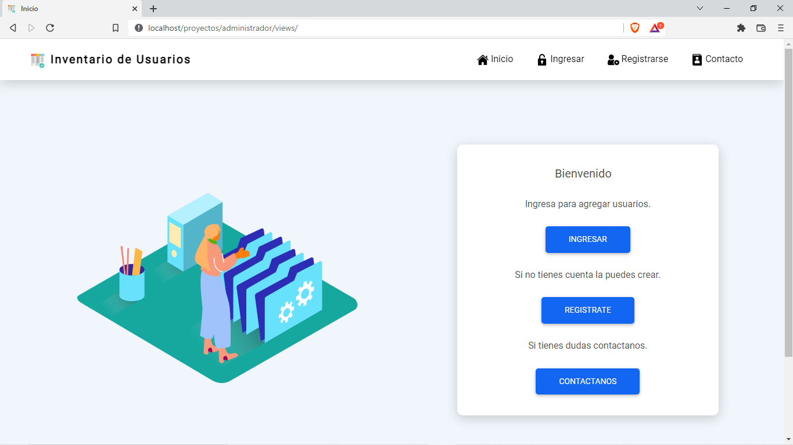

<!DOCTYPE html>
<html>

<head>
	<meta http-equiv="Content-type" content="text/html;charset=UTF-8">
	<link rel="stylesheet" type="text/css" href="readme/css/style.css">
	<link rel="stylesheet" type="text/css" href="readme/css/style-readme.css">
</head>

<body>
	

		<nav class="table-of-contents">
			<ol>
				<li><a href="#crud-con-php%2C-mysql%2C-jquery.">CRUD Con PHP, MySQL, jQuery.</a>
					<ol>
						<li><a href="#roles">Roles</a>
							<ol>
								<li><a href="#super-administrador">Super Administrador</a></li>
								<li><a href="#administrador">Administrador</a></li>
							</ol>
						</li>
						<li><a href="#tecnolog%C3%ADas.">Tecnologías.</a></li>
						<li><a href="#vistas.">Vistas.</a>
							<ol>
								<li><a href="#inicio.">Inicio.</a></li>
								<li><a href="#ingreso.">Ingreso.</a></li>
								<li><a href="#registro.">Registro.</a></li>
								<li><a href="#contacto.">Contacto.</a></li>
							</ol>
						</li>
						<li><a href="#vistas-como-administrador.">Vistas como Administrador.</a>
							<ol>
								<li><a href="#tabla-usuarios.">Tabla Usuarios.</a></li>
							</ol>
						</li>
						<li><a href="#vista-como-super-administrador.">Vista como Super Administrador.</a>
							<ol>
								<li><a href="#tabla-usuarios.-1">Tabla Usuarios.</a></li>
								<li><a href="#tabla-administradores.">Tabla Administradores.</a></li>
							</ol>
						</li>
						<li><a href="#cuenta-super-administrador">Cuenta Super Administrador</a>
							<ol>
								<li><a href="#super-administrador.">Super Administrador.</a>
									<ol>
										<li><a href="#*-correo">* Correo</a></li>
										<li><a href="#*-contrase%C3%B1a">* Contraseña</a></li>
									</ol>
								</li>
							</ol>
						</li>
						<li><a href="#santiago-manosalva-fern%C3%A1ndez.">Santiago Manosalva Fernández.</a></li>
					</ol>
				</li>
			</ol>
		</nav>
		<h1 id="crud-con-php%2C-mysql%2C-jquery." id="crud-con-php-mysql-jquery"><strong>CRUD Con PHP, MySQL,
				jQuery.</strong></h1>
		<h2 id="roles" id="roles">Roles</h2>
		<h3 id="super-administrador" id="super-administrador">Super Administrador</h3>
		<ul>
			<li>Tiene todo el control de la <strong>tabla usuarios.</strong></li>
			<li>Tiene el control de los <strong>administradores.</strong></li>
		</ul>
		<h3 id="administrador" id="administrador">Administrador</h3>
		<ul>
			<li>Tiene el control de la tabla <strong>usuarios.</strong></li>
		</ul>
		<h2 id="tecnolog%C3%ADas." id="tecnologias">Tecnologías.</h2>
		<ol>
			<li><strong>PHP 8.1.2.</strong></li>
			<li><strong>JavaScript - jQuery, Ajax y SweetAlert 2.</strong></li>
			<li><strong>MySQL 5.1.0.</strong></li>
			<li><strong>HTML 5.</strong></li>
			<li><strong>CSS 3 - Bootstrap 5.1.3.</strong></li>
		</ol>
		<h2 id="vistas." id="vistas">Vistas.</h2>
		<h3 id="inicio." id="inicio">Inicio.</h3>
		<ul>
			<li>Bienvenida.</li>
			<li>Ingreso.</li>
			<li>Registro.</li>
			<li>Contacto.</li>
		</ul>
		

		<h3 id="ingreso." id="ingreso">Ingreso.</h3>
		<ul>
			<li>Si tienes cuenta puedes ingresar.</li>
			<li>Si creas la cuenta tendras el control de la tabla <strong>usuarios.</strong></li>
		</ul>
		

		<h3 id="registro." id="registro">Registro.</h3>
		<ul>
			<li>Crea tu cuenta y podras agregar, editar y borrar <strong>usuarios.</strong></li>
		</ul>
		

		<h3 id="contacto." id="contacto">Contacto.</h3>
		

		<h2 id="vistas-como-administrador." id="vistas-como-administrador">Vistas como Administrador.</h2>
		<ul>
			<li>Si inicias sesión tienes el control de la tabla usuarios y puedes crear, editar y borrar
				<strong>usuarios.</strong></li>
			<li>Puedes ver tus datos de registro y tu rol.</li>
		</ul>
		<h3 id="tabla-usuarios." id="tabla-usuarios">Tabla Usuarios.</h3>
		

		<h2 id="vista-como-super-administrador." id="vista-como-super-administrador">Vista como Super Administrador.
		</h2>
		<ul>
			<li>Si eres <strong>Super Administrador</strong> tienes el control de la tabla <strong>Usuarios</strong> y
				la tabla <strong>Administradores</strong> en las dos tablas puedes crear, editar y borrar
				<strong>usuarios</strong> y <strong>administradores.</strong></li>
			<li>Puedes ver tus datos de registro y tu rol.</li>
		</ul>
		<h3 id="tabla-usuarios.-1" id="tabla-usuarios">Tabla Usuarios.</h3>
		<ul>
			<li>Son los uaurios que agregan los <strong>administradores.</strong></li>
			<li>Los <strong>administradores</strong> son los usuarios que se registran.</li>
		</ul>
		

		<h3 id="tabla-administradores." id="tabla-administradores">Tabla Administradores.</h3>
		<ul>
			<li>Son los usuarios que se registran.</li>
			<li>Los usuarios que se registran tienen el rol de <strong>administradores,</strong> los cuales puedes ver
				en la tabla administradores.</li>
		</ul>
		

		<h2 id="cuenta-super-administrador" id="cuenta-super-administrador">Cuenta Super Administrador</h2>
		

		<h3 id="super-administrador." id="super-administrador">Super Administrador.</h3>
		<h4 id="*-correo" id="correo">* Correo</h4>
		<ul>
			<li><em>santiago@gmail.com</em></li>
		</ul>
		<h4 id="*-contrase%C3%B1a" id="contrasena">* Contraseña</h4>
		<ul>
			<li><em>Santiago2022</em></li>
		</ul>
		<h2 id="santiago-manosalva-fern%C3%A1ndez." id="santiago-manosalva-fernandez">Santiago Manosalva Fernández.</h2>
		
<a target="_blank" href="https://www.facebook.com/santii.manosalva">Facebook</a>

		
<a target="_blank"
				href="https://www.linkedin.com/in/santiago-manosalva-fern%C3%A1ndez-b648241b8/">LinKedin</a>

	

</body>

</html>
