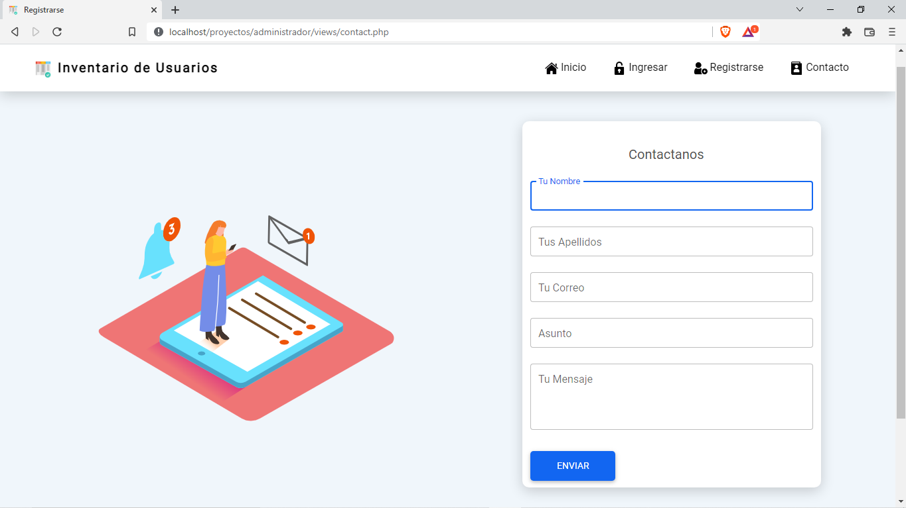

# **CRUD Con PHP, MySQL y jQuery.**

## ¿Que es un CRUD?
En programación solemos usar el término CRUD para referirnos a las operaciones básicas que puedes realizar sobre un conjunto de datos y por sus siglas son:
Crearlos, ya sabes, nuevos registros, cuando hablamos de bases de datos esto quiere decir insertar información.
Leerlos, r por Read, esto quiere decir consultar esa información, ya sea un registro o una colección de estos registros.
Actualizarlos, u por Update, que significa tomar un registro que ya existe en la base de datos y modificar alguna de las columnas.
Por último eliminar registros, d por Delete, que significa tomar un registro y quitarlo del almacén.

## Roles.

### Super Administrador.

* Tiene el control de la **tabla usuarios.**
* Tiene el control de los **administradores.**

### Administrador.

* Tiene el control de la tabla **usuarios.**

## Tecnologías.

1. **PHP 8.1.2.**
2. **JavaScript - jQuery 3.3.1, Ajax y SweetAlert 2.**
3. **MySQL 5.1.0.**
4. **HTML 5.**
5. **CSS 3 - Bootstrap 5.1.3.**

## Vistas.

### Inicio.

* Bienvenida.
* Ingreso.
* Registro.
* Contacto.

### Ingreso.

* Si tienes cuenta puedes ingresar.
* Si creas la cuenta tendras el control de la tabla **usuarios.**

### Registro.

* Crea tu cuenta y podras agregar, editar y borrar **usuarios.**

### Contacto.

## Vistas como Administrador.

* Si inicias sesión tienes el control de la tabla usuarios y puedes crear, editar y borrar **usuarios.**
* Puedes ver tus datos de registro y tu rol.

### Tabla Usuarios.

## Vista como Super Administrador.

* Si eres **Super Administrador** tienes el control de la tabla **Usuarios** y la tabla **Administradores** en las dos tablas puedes crear, editar y borrar **usuarios** y **administradores.**
* Puedes ver tus datos de registro y tu rol.

### Tabla Usuarios.

* Son los uaurios que agregan los **administradores.**
* Los **administradores** son los usuarios que se registran.

### Tabla Administradores.

* Son los usuarios que se registran.
* Los usuarios que se registran tienen el rol de **administradores,** los cuales puedes ver en la tabla administradores.

## Cuenta Super Administrador

### Super Administrador.

#### * Correo

* *santiago@gmail.com*

#### * Contraseña

* *Santiago2022*

## Santiago Manosalva Fernández.

[Facebook](https://www.facebook.com/santii.manosalva)

[LinKedin](https://www.linkedin.com/in/santiago-manosalva-fern%C3%A1ndez-b648241b8/)
